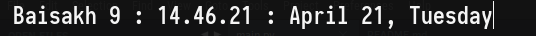

## Nepali Friendly Datetime Applet

A simple taskbar applet to show realtime datetime along with nepali date for budgie desktops.

## Look At Present

### TODOS:

01. [x] Make it self updating
02. [ ] Build it with meson
03. [ ] Build it with GTK
04. [ ] Add Nepali date specifiers like strftime
05. [ ] Support for custom Nepali date specifiers
06. [x] Make flask app out of this
